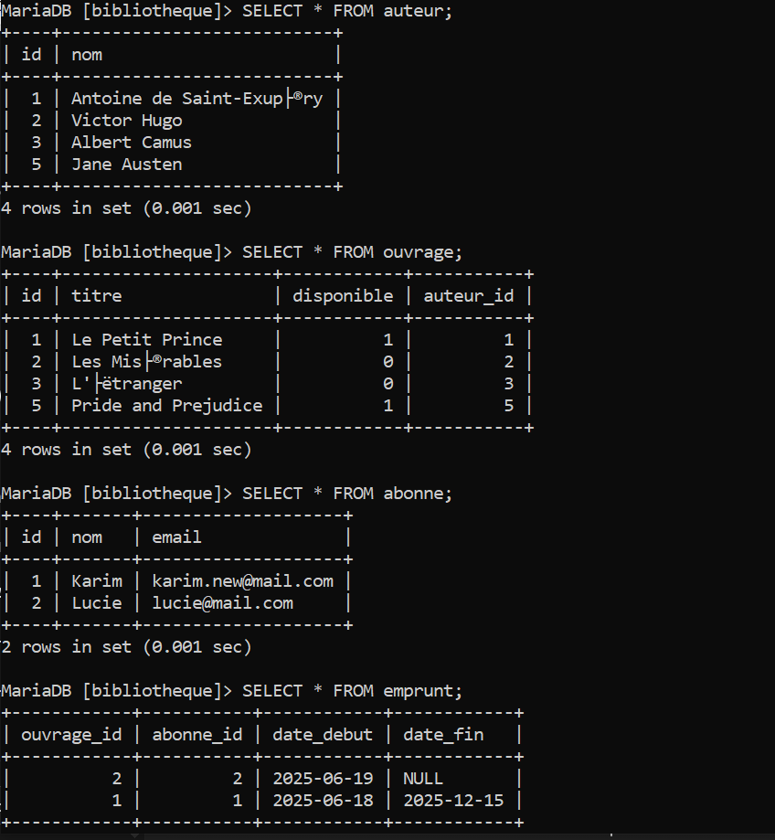
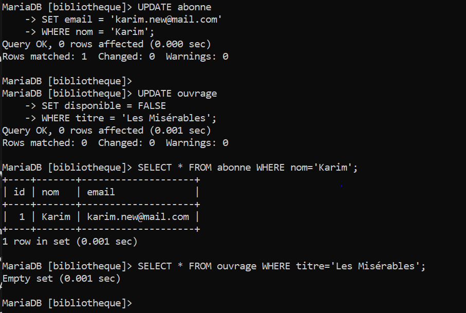
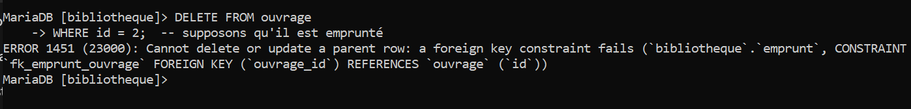
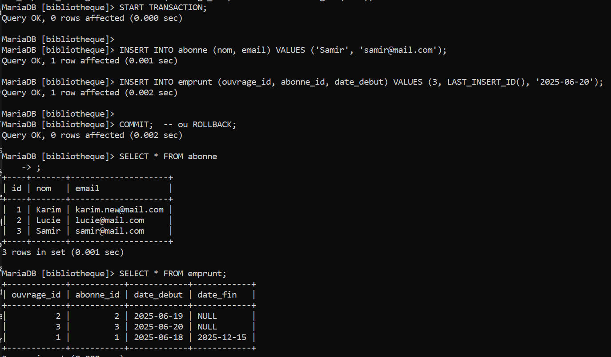

# Lab 4 – Manipulation des données (CRUD)

## 📋 Objectif

Apprendre à manipuler les données au sein des tables via les commandes **INSERT**, **UPDATE** et **DELETE**, tout en respectant l'intégrité référentielle et en découvrant la gestion de transactions.

---

## 🔧 Prérequis

- Avoir exécuté les Labs 1 à 3, de sorte que la base `bibliotheque` et ses tables (`auteur`, `ouvrage`, `abonne`, `emprunt`) soient présentes
- Accès à la CLI MySQL ou à un outil équivalent (MySQL Workbench, phpMyAdmin, etc.)
- Les tables doivent avoir les contraintes suivantes :
  - `ouvrage.auteur_id` → FK vers `auteur.id` avec `ON DELETE CASCADE`
  - `emprunt.ouvrage_id` → FK vers `ouvrage.id` avec `ON DELETE RESTRICT`
  - `emprunt.abonne_id` → FK vers `abonne.id` avec `ON DELETE CASCADE`

---

## 🚀 Étape 1 – Connexion à la base

### Lancement de la CLI MySQL

```bash
mysql -u root -p
```

Entrez votre mot de passe root lorsque demandé.

### Sélection de la base de données

```sql
USE bibliotheque;
```

**Résultat attendu :**
```
Database changed
```

---

## ➕ Étape 2 – INSERT : création de nouveaux enregistrements

### 2.1 - Ajouter des auteurs

```sql
INSERT INTO auteur (nom)
VALUES 
  ('Victor Hugo'),
  ('George Orwell'),
  ('Jane Austen');
```

**Résultat attendu :**
```
Query OK, 3 rows affected (0.01 sec)
Records: 3  Duplicates: 0  Warnings: 0
```

**Vérification :**
```sql
SELECT * FROM auteur;
```

**Résultat :**

| id | nom           |
|----|---------------|
| 1  | Victor Hugo   |
| 2  | George Orwell |
| 3  | Jane Austen   |

---

### 2.2 - Ajouter des ouvrages

**Récupération de l'ID d'un auteur :**
```sql
SELECT id, nom FROM auteur WHERE nom='Victor Hugo';
```

**Résultat :**

| id | nom         |
|----|-------------|
| 1  | Victor Hugo |

**Insertion des ouvrages :**
```sql
INSERT INTO ouvrage (titre, disponible, auteur_id)
VALUES 
  ('Les Misérables', TRUE, 1),
  ('1984', FALSE, 2),
  ('Pride and Prejudice', TRUE, 3);
```

**Résultat attendu :**
```
Query OK, 3 rows affected (0.01 sec)
Records: 3  Duplicates: 0  Warnings: 0
```

**Vérification :**
```sql
SELECT o.id, o.titre, o.disponible, a.nom AS auteur
FROM ouvrage o
JOIN auteur a ON o.auteur_id = a.id;
```

**Résultat :**

| id | titre               | disponible | auteur        |
|----|---------------------|------------|---------------|
| 1  | Les Misérables      | 1          | Victor Hugo   |
| 2  | 1984                | 0          | George Orwell |
| 3  | Pride and Prejudice | 1          | Jane Austen   |

---

### 2.3 - Ajouter des abonnés

```sql
INSERT INTO abonne (nom, email)
VALUES 
  ('Karim', 'karim@mail.com'),
  ('Lucie', 'lucie@mail.com');
```

**Résultat attendu :**
```
Query OK, 2 rows affected (0.01 sec)
Records: 2  Duplicates: 0  Warnings: 0
```

**Vérification :**
```sql
SELECT * FROM abonne;
```

**Résultat :**

| id | nom   | email            |
|----|-------|------------------|
| 1  | Karim | karim@mail.com   |
| 2  | Lucie | lucie@mail.com   |

---

### 2.4 - Enregistrer un emprunt

```sql
INSERT INTO emprunt (ouvrage_id, abonne_id, date_debut)
VALUES (2, 1, '2025-06-18');
```

**Résultat attendu :**
```
Query OK, 1 row affected (0.01 sec)
```

**Vérification :**
```sql
SELECT e.id, o.titre, ab.nom AS abonne, e.date_debut, e.date_fin
FROM emprunt e
JOIN ouvrage o ON e.ouvrage_id = o.id
JOIN abonne ab ON e.abonne_id = ab.id;
```

**Résultat :**

| id | titre | abonne | date_debut | date_fin |
|----|-------|--------|------------|----------|
| 1  | 1984  | Karim  | 2025-06-18 | NULL     |

---

### 📸 Capture 1 : État des tables après les INSERT



---

## ✏️ Étape 3 – UPDATE : modification des données

### 3.1 - Marquer un ouvrage comme indisponible

```sql
UPDATE ouvrage
SET disponible = FALSE
WHERE titre = 'Les Misérables';
```

**Résultat attendu :**
```
Query OK, 1 row affected (0.01 sec)
Rows matched: 1  Changed: 1  Warnings: 0
```

**Vérification :**
```sql
SELECT id, titre, disponible FROM ouvrage WHERE titre = 'Les Misérables';
```

**Résultat :**

| id | titre          | disponible |
|----|----------------|------------|
| 1  | Les Misérables | 0          |

---

### 3.2 - Mettre à jour l'email d'un abonné

```sql
UPDATE abonne
SET email = 'karim.new@mail.com'
WHERE nom = 'Karim';
```

**Résultat attendu :**
```
Query OK, 1 row affected (0.01 sec)
Rows matched: 1  Changed: 1  Warnings: 0
```

**Vérification :**
```sql
SELECT * FROM abonne WHERE nom = 'Karim';
```

**Résultat :**

| id | nom   | email               |
|----|-------|---------------------|
| 1  | Karim | karim.new@mail.com  |

---

### 3.3 - Clôturer un emprunt en renseignant date_fin

```sql
UPDATE emprunt
SET date_fin = CURDATE()
WHERE id = 1;
```

**Résultat attendu :**
```
Query OK, 1 row affected (0.01 sec)
Rows matched: 1  Changed: 1  Warnings: 0
```

**Vérification :**
```sql
SELECT * FROM emprunt WHERE id = 1;
```

**Résultat :**

| id | ouvrage_id | abonne_id | date_debut | date_fin   |
|----|------------|-----------|------------|------------|
| 1  | 2          | 1         | 2025-06-18 | 2025-06-19 |

**Astuce :** Vous pouvez combiner les conditions avec AND ou OR pour cibler précisément les lignes à modifier :

```sql
UPDATE ouvrage
SET disponible = TRUE
WHERE auteur_id = 1 AND disponible = FALSE;
```

---

### 📸 Capture 2 : Résultat d'un UPDATE



---

## 🗑️ Étape 4 – DELETE : suppression des enregistrements

### 4.1 - Supprimer un auteur et observer la cascade

```sql
DELETE FROM auteur
WHERE nom = 'George Orwell';
```

**Résultat attendu :**
```
Query OK, 1 row affected (0.01 sec)
```

**Important :** Les ouvrages liés à cet auteur sont automatiquement supprimés grâce au `ON DELETE CASCADE` défini sur la clé étrangère `auteur_id`.

**Vérification :**
```sql
SELECT * FROM ouvrage WHERE auteur_id = 2;
```

**Résultat :**
```
Empty set (0.00 sec)
```

L'ouvrage "1984" a été supprimé automatiquement.

---

### 4.2 - Tenter de supprimer un ouvrage emprunté (verrou RESTRICT)

D'abord, créons un nouvel emprunt pour tester :

```sql
INSERT INTO emprunt (ouvrage_id, abonne_id, date_debut)
VALUES (3, 2, '2025-06-19');
```

Maintenant, tentons de supprimer l'ouvrage emprunté :

```sql
DELETE FROM ouvrage
WHERE id = 3;
```

**Résultat attendu :**
```
ERROR 1451 (23000): Cannot delete or update a parent row: 
a foreign key constraint fails (`bibliotheque`.`emprunt`, 
CONSTRAINT `emprunt_ibfk_1` FOREIGN KEY (`ouvrage_id`) 
REFERENCES `ouvrage` (`id`) ON DELETE RESTRICT)
```

**Explication :** La suppression échoue car l'ouvrage a un emprunt actif et la contrainte `ON DELETE RESTRICT` empêche cette opération. Il faut d'abord clôturer ou supprimer l'emprunt.

---

### 📸 Capture 3 : Message d'erreur DELETE bloqué


---

### 4.3 - Supprimer un abonné

```sql
DELETE FROM abonne
WHERE nom = 'Lucie';
```

**Résultat attendu :**
```
Query OK, 1 row affected (0.01 sec)
```

**Important :** Tous les emprunts de Lucie sont automatiquement supprimés grâce au `ON DELETE CASCADE` sur la table `emprunt`.

**Vérification :**
```sql
SELECT * FROM emprunt WHERE abonne_id = 2;
```

**Résultat :**
```
Empty set (0.00 sec)
```

L'emprunt de Lucie a été supprimé automatiquement.

---

## 🔄 Étape 5 – Transactions : grouper plusieurs opérations atomiquement

### 5.1 - Démarrer une transaction manuelle

```sql
START TRANSACTION;
```

**Résultat attendu :**
```
Query OK, 0 rows affected (0.00 sec)
```

---

### 5.2 - Enchaîner plusieurs opérations

```sql
INSERT INTO abonne (nom, email) VALUES ('Samir', 'samir@mail.com');

INSERT INTO emprunt (ouvrage_id, abonne_id, date_debut) 
VALUES (1, LAST_INSERT_ID(), '2025-06-19');
```

**Résultat attendu :**
```
Query OK, 1 row affected (0.00 sec)
Query OK, 1 row affected (0.00 sec)
```

**Vérification temporaire (avant COMMIT) :**
```sql
SELECT * FROM abonne WHERE nom = 'Samir';
```

**Résultat :**

| id | nom   | email           |
|----|-------|-----------------|
| 3  | Samir | samir@mail.com  |

---

### 5.3 - Valider ou annuler

#### Option A : Valider la transaction

```sql
COMMIT;
```

**Résultat attendu :**
```
Query OK, 0 rows affected (0.01 sec)
```

Les modifications sont maintenant permanentes dans la base de données.

**Vérification finale :**
```sql
SELECT e.id, o.titre, ab.nom AS abonne, e.date_debut
FROM emprunt e
JOIN ouvrage o ON e.ouvrage_id = o.id
JOIN abonne ab ON e.abonne_id = ab.id
WHERE ab.nom = 'Samir';
```

**Résultat :**

| id | titre          | abonne | date_debut |
|----|----------------|--------|------------|
| 2  | Les Misérables | Samir  | 2025-06-19 |

---

#### Option B : Annuler la transaction

Si vous souhaitez tester l'annulation, recommencez l'étape 5.1 et 5.2, puis :

```sql
ROLLBACK;
```

**Résultat attendu :**
```
Query OK, 0 rows affected (0.00 sec)
```

**Vérification :**
```sql
SELECT * FROM abonne WHERE nom = 'Samir';
```

**Résultat :**
```
Empty set (0.00 sec)
```

Toutes les opérations de la transaction ont été annulées.

---

### 📸 Capture 4 : Transaction (COMMIT ou ROLLBACK)



---

### 💡 Pourquoi les transactions ?

Les transactions garantissent que **toutes les opérations réussissent ou que rien n'est appliqué** en cas d'échec, ce qui prévient la corruption partielle des données.

**Cas d'usage :**
- Créer un abonné ET son premier emprunt simultanément
- Transférer un ouvrage d'un abonné à un autre
- Mettre à jour plusieurs tables liées de manière cohérente

**Propriétés ACID :**
- **Atomicité** : tout ou rien
- **Cohérence** : respect des contraintes
- **Isolation** : transactions indépendantes
- **Durabilité** : modifications permanentes après COMMIT

---

